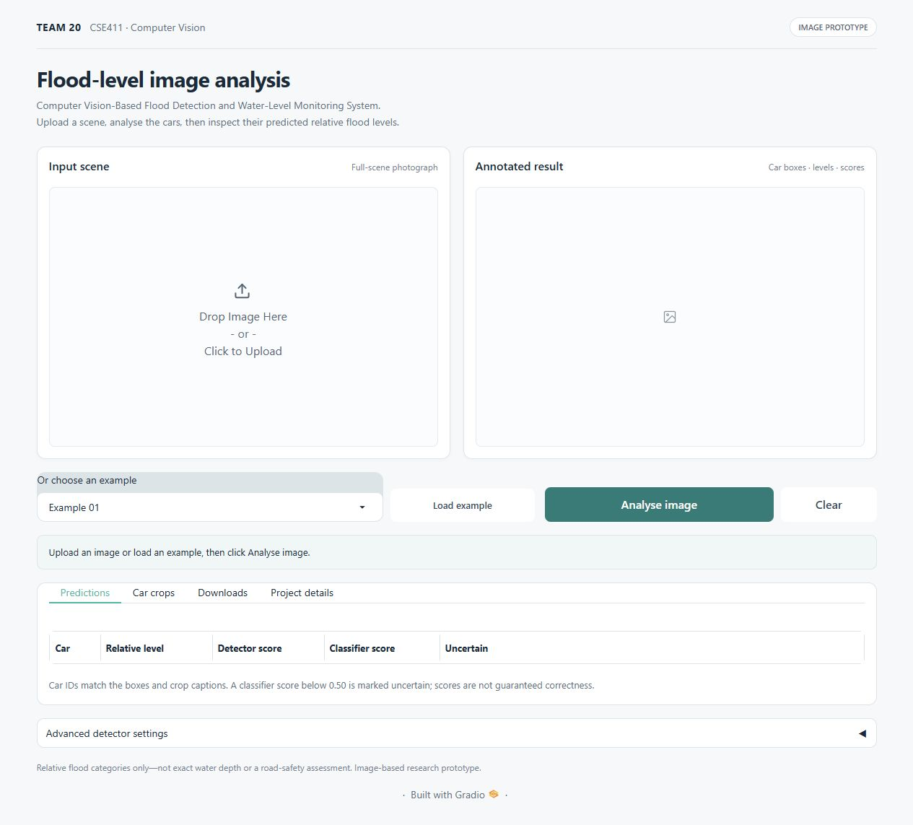

# Computer Vision-Based Flood Detection and Water-Level Monitoring System

An image-based prototype that locates cars in a flooded scene and assigns a relative flood-level category to each detected car crop.

The system combines a **COCO-pretrained YOLOv8n detector** with a **ResNet-50 classifier trained on STURM-FloodDepth crops**. It does not train YOLO on STURM, measure exact water depth, or decide whether a road is safe.

## Run the project

The notebooks are the supported Google Colab workflow. The Python files are readable exports of those notebooks, not independent desktop applications.

| Notebook | Purpose | Inputs needed |
| --- | --- | --- |
| [Gradio demo](notebooks/gradio_demo.ipynb) | Upload an image, view car boxes and relative levels, inspect crops, download results | Saved ResNet-50 checkpoint; example photographs are optional |
| [Integrated evaluation](notebooks/project_evaluation.ipynb) | Evaluate the classifier, process scene photographs and compare detector settings | Official dataset/splits, saved checkpoint, matching training history, scene photographs |
| [Classifier training](notebooks/classifier_training.ipynb) | Reproduce the five-epoch classifier procedure when a checkpoint is not available | Official STURM dataset and split lists |

For the quickest demonstration, open the Gradio notebook in Colab, select a GPU runtime, check the paths in Section 3 and run Sections 1–8 in order. Section 8 prints a temporary link and login. Keep the runtime connected while using the page. Back up results with Section 9 before ending the session.

See [setup and checkpoint instructions](docs/setup.md) before running. The dataset and trained weights are **not bundled in this repository**. If you do not have the evaluated checkpoint, the training notebook can produce a new one; its scores may differ from the published experiment.

## Interface



The interface separates the input scene, annotated result, prediction table, padded crops and downloads. Advanced detector settings are collapsed by default. The screenshot shows the empty layout; it is not a model-evaluation result.

## Method

Full-scene image → pretrained car detection → 20% padding on each side of a detected box → crop from the original pixels → RGB / 224 × 224 / ImageNet normalization → ResNet-50 → Level0–Level4 with separate detector and classifier scores.

The baseline detector confidence is **0.30**, NMS IoU is **0.45**, and inference size is **640**. A classifier score below **0.50** is marked uncertain, not treated as a sixth class. The [methodology](docs/methodology.md) describes training, selection and inference separately.

## Verified results and limits

ResNet-50 was evaluated on **340 labelled STURM test crops**, using the checkpoint selected by validation macro F1:

| Classifier metric | Result |
| --- | --- |
| Accuracy | 74.71% — 254 / 340 crops |
| Macro precision | 75.39% |
| Macro recall | 76.26% |
| Macro F1 | 75.73% |

These are **crop-classifier metrics**, not YOLO detection accuracy or end-to-end scene accuracy. The ten unlabelled scene demonstrations returned 24 baseline boxes and 40 exploratory boxes; those are diagnostic prediction counts, not verified correct detections.

The separate Gradio backup contains **10 unique analyses of 4 photographs**, with 13 prediction rows and 2 uncertain rows. Repeated backups were not double-counted. These scene outputs also lack verified ground truth. Cars can be missed, a box can be wrong, and a confident classification can still be incorrect.

See [results and limitations](docs/results.md), the [saved classifier results](results/classifier/), the [Gradio run records](results/gradio/), and the [final report](reports/Final_Project_Report.pdf).

## Files and reproducibility

- `notebooks/`: clean, unexecuted notebooks for training, evaluation and the Gradio demo.
- `src/`: matching Python exports, including the complete demo interface and inference workflow.
- `results/`: aggregate classifier results and saved Gradio CSV/JSON records; not training images or model weights.
- `docs/`: setup, methodology, limitations, image credits and selected presentation assets.
- `reports/`: the revised final project report, with this repository linked on the cover and in the source-code section.
- `tests/`: source-contract and evidence-consistency checks that do not require training or a GPU.

Run the lightweight repository checks with:

```bash
python -m unittest discover -s tests -v
```

These checks validate source structure and saved-record consistency. They do not run the actual trained models or measure scene accuracy. Executed notebooks and complete result archives are kept in the separate course-submission package; public source notebooks have their outputs removed.

## Team

Mahendra K — 2023BCS0235  
Sanin K — 2023BCS0232  
Bhukya Gandhi — 2023BCS0238  
Ankit Subhash — 2022BCD0001

## Attribution and licence

The integrated source is released under **AGPL-3.0-only**; see [LICENSE](LICENSE) and [third-party notices](THIRD_PARTY_NOTICES.md). Ultralytics YOLO is used under its AGPL-3.0 licence. Dataset material and photographs keep their original rights and are not relicensed by this repository. Source pages, authors and image licences are listed in [image credits](docs/image_credits.csv).

Research basis: [Wan et al., vehicle-based flood assessment](https://doi.org/10.1016/j.jhydrol.2024.131625). Classifier dataset: [Notarangelo, STURM-FloodDepth Flooded Cars](https://zenodo.org/records/14833532). Models: [Ultralytics YOLOv8](https://docs.ultralytics.com/models/yolov8/) and [ResNet](https://arxiv.org/abs/1512.03385).

GitHub hosts this source code, not a continuously running website. The password-protected Gradio share link is temporary and depends on the Colab runtime.
